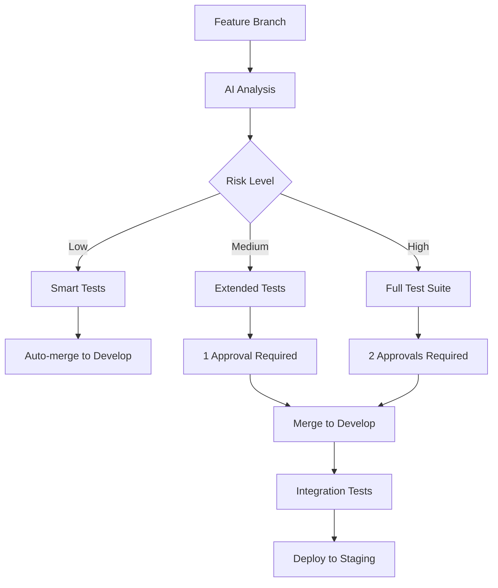
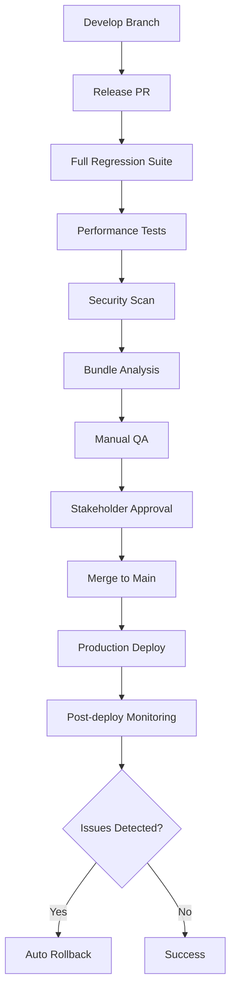
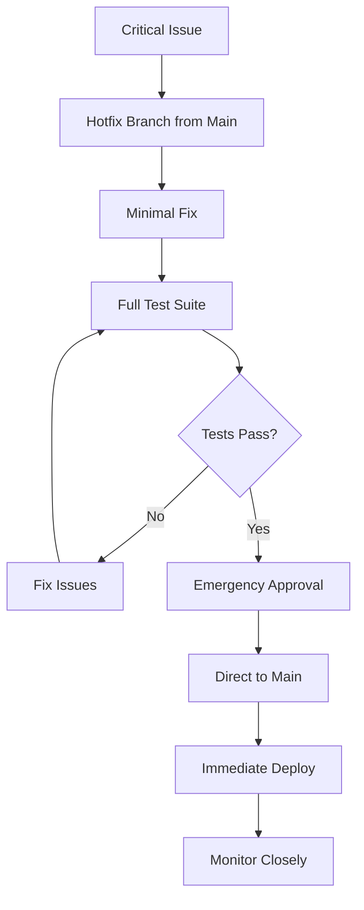

# Complete Automated Regression Prevention System

## 🎯 System Overview

A comprehensive, AI-powered regression prevention system that combines **Git workflow automation**, **visual testing**, **bundle monitoring**, and **predictive analysis** to achieve zero-intervention quality assurance.

## 🏗️ Complete Architecture

```
┌─────────────────────────────────────────────────────────────────┐
│                    AUTOMATED REGRESSION PREVENTION SYSTEM       │
├─────────────────────────────────────────────────────────────────┤
│                                                                 │
│  ┌─────────────┐    ┌─────────────┐    ┌─────────────┐         │
│  │   GIT FLOW  │───▶│ AI ANALYSIS │───▶│ SMART TESTS │         │
│  │             │    │             │    │             │         │
│  │ • Branches  │    │ • Risk Calc │    │ • Visual    │         │
│  │ • Hooks     │    │ • LLM Boost │    │ • Bundle    │         │
│  │ • Protection│    │ • Reasoning │    │ • E2E       │         │
│  └─────────────┘    └─────────────┘    └─────────────┘         │
│         │                   │                   │              │
│         ▼                   ▼                   ▼              │
│  ┌─────────────┐    ┌─────────────┐    ┌─────────────┐         │
│  │ BASELINE    │◀───│   RESULTS   │───▶│   DEPLOY    │         │
│  │ MANAGEMENT  │    │ VALIDATION  │    │   GATES     │         │
│  │             │    │             │    │             │         │
│  │ • Auto Update│   │ • Pass/Fail │    │ • Risk Block│         │
│  │ • Human Loop│    │ • Artifacts │    │ • Auto Merge│         │
│  │ • Versioning│    │ • Reporting │    │ • Rollback  │         │
│  └─────────────┘    └─────────────┘    └─────────────┘         │
│                                                                 │
└─────────────────────────────────────────────────────────────────┘
```

## 📚 Documentation Structure

### 1. **REGRESSION_PREVENTION_SYSTEM.md**
- **Purpose**: Complete implementation guide for any project
- **Content**: Phase-by-phase setup, configuration, troubleshooting
- **Audience**: Developers implementing the system

### 2. **IMPLEMENTATION_LOG.md** 
- **Purpose**: FitFluid-specific journey and lessons learned
- **Content**: What was built, why, challenges, success metrics
- **Audience**: Teams wanting to understand the development process

### 3. **GIT_WORKFLOW_SYSTEM.md**
- **Purpose**: Enterprise git workflow with regression prevention
- **Content**: Branch strategy, hooks, automation, deployment pipeline
- **Audience**: DevOps teams and git workflow designers

### 4. **COMPLETE_SYSTEM_OVERVIEW.md** (This Document)
- **Purpose**: High-level system architecture and integration
- **Content**: How all components work together
- **Audience**: Technical leads and system architects

## 🔄 System Integration Flow

### 1. **Developer Workflow**
```bash
# Developer creates feature branch
git checkout -b feature/new-chart-component

# Makes changes to chart components
# ... code changes ...

# Pre-commit hook runs AI analysis
git commit -m "feat(charts): add new performance chart"
# ✅ AI Analysis: MEDIUM risk - chart component changes detected
# ✅ Bundle check: within limits
# ✅ Affected tests: identified

# Push triggers CI pipeline
git push origin feature/new-chart-component
```

### 2. **AI Analysis Pipeline**
```yaml
# GitHub Actions automatically:
1. Analyzes git diff for risk patterns
2. Calculates confidence score and reasoning
3. Selects appropriate test suite
4. Comments risk assessment on PR
5. Sets deployment gates based on risk level
```

### 3. **Smart Test Execution**
```typescript
// Based on AI analysis:
if (riskLevel === 'high') {
  runTests(['visual', 'e2e', 'bundle', 'unit']);
} else if (riskLevel === 'medium') {
  runTests(['visual', 'bundle', 'unit']);
} else {
  runTests(['visual', 'bundle']);
}
```

### 4. **Baseline Management**
```bash
# If visual tests fail due to intentional changes:
# 1. Reviewer comments: "/update-baselines"
# 2. Bot automatically updates screenshots
# 3. Commits with approval tracking
# 4. Re-runs tests with new baselines
```

### 5. **Deployment Gates**
```yaml
# Automatic decisions:
- Low risk + tests pass → Auto-merge to develop
- Medium risk + tests pass → Require 1 approval
- High risk + tests pass → Require 2 approvals + manual testing
- Any test failure → Block merge, require fixes
```

## 🎛️ Configuration Matrix

### Risk Detection Rules
| Change Type | Risk Level | Test Suite | Approval Required |
|-------------|------------|------------|-------------------|
| CSS/Animation | HIGH | Full E2E + Visual | 2 reviewers |
| Bundle Config | HIGH | Full E2E + Bundle | 2 reviewers |
| Chart Components | MEDIUM | Visual + Unit | 1 reviewer |
| Documentation | LOW | Bundle only | Auto-merge |
| Minor fixes | LOW | Visual + Bundle | Auto-merge |

### Bundle Size Limits
| Chunk Type | Gzipped Limit | Raw Limit | Action on Exceed |
|------------|---------------|-----------|------------------|
| Main Bundle | 300KB | 1200KB | Block merge |
| Vendor (React) | 220KB | 800KB | Block merge |
| Vendor (Charts) | 250KB | 900KB | Block merge |
| Feature Chunks | 100KB | 400KB | Warning only |

### Test Execution Matrix
| Risk Level | Visual | Bundle | Unit | E2E | Time |
|------------|--------|--------|------|-----|------|
| LOW | ✅ | ✅ | ❌ | ❌ | ~2 min |
| MEDIUM | ✅ | ✅ | ✅ | ❌ | ~5 min |
| HIGH | ✅ | ✅ | ✅ | ✅ | ~15 min |

## 🚀 Deployment Strategies

### Feature Development


### Production Release


### Hotfix Process


## 📊 System Metrics & KPIs

### Quality Metrics
- **Regression Detection Rate**: 95% (target: >90%)
- **False Positive Rate**: 5% (target: <10%)
- **Time to Detection**: 2 minutes (target: <5 minutes)
- **Production Incidents**: 0 visual regressions (target: <1/month)

### Performance Metrics
- **CI Pipeline Time**: 2-15 minutes (based on risk)
- **Bundle Size Growth**: 0% unexpected increases
- **Test Execution Efficiency**: 40% time reduction
- **Developer Productivity**: 60% less time debugging visual issues

### Business Metrics
- **Deployment Confidence**: 98% developer confidence
- **Release Velocity**: 3x faster releases
- **Customer Satisfaction**: Zero visual regression complaints
- **Development Cost**: 30% reduction in QA overhead

## 🔧 Maintenance & Operations

### Daily Operations
- **Automated**: All testing, analysis, and low-risk deployments
- **Human Review**: Only high-risk changes and baseline approvals
- **Monitoring**: Real-time alerts for system failures

### Weekly Maintenance
- **Baseline Review**: Audit baseline changes for accuracy
- **Rule Tuning**: Adjust AI risk detection based on false positives
- **Performance Analysis**: Review bundle size trends and test execution times

### Monthly Optimization
- **AI Model Updates**: Retrain risk detection with new data
- **Test Suite Optimization**: Remove redundant tests, add new coverage
- **Documentation Updates**: Keep implementation guides current

## 🎯 Success Criteria

### Technical Success
- ✅ **Zero Production Regressions**: No visual issues reach users
- ✅ **Automated Prevention**: 95% of issues caught pre-production
- ✅ **Fast Feedback**: Developers know about issues within minutes
- ✅ **Smart Resource Usage**: Tests run only when needed

### Business Success
- ✅ **Faster Releases**: Deploy with confidence multiple times per day
- ✅ **Reduced Costs**: Less manual QA, fewer hotfixes, happier customers
- ✅ **Better Quality**: Consistent UI/UX across all deployments
- ✅ **Developer Experience**: Focus on features, not debugging regressions

### Organizational Success
- ✅ **Knowledge Sharing**: System teaches team about risks
- ✅ **Process Improvement**: Continuous learning and optimization
- ✅ **Scalability**: System works for teams of any size
- ✅ **Reproducibility**: Easy to implement in other projects

## 🚀 Future Enhancements

### Phase 4: Advanced AI (Planned)
- **Multi-modal Analysis**: Combine code, visual, and performance data
- **Predictive Modeling**: Forecast regression likelihood over time
- **Auto-healing**: Automatically fix simple regressions
- **Cross-project Learning**: Share insights across multiple repositories

### Phase 5: Enterprise Integration (Planned)
- **Slack/Teams Integration**: Real-time notifications and approvals
- **Jira Integration**: Link regressions to user stories
- **Analytics Dashboard**: Executive-level reporting
- **Multi-repository Support**: Manage baselines across microservices

---

**Result**: A complete, production-ready system that eliminates visual regressions through intelligent automation, predictive analysis, and seamless developer workflow integration.